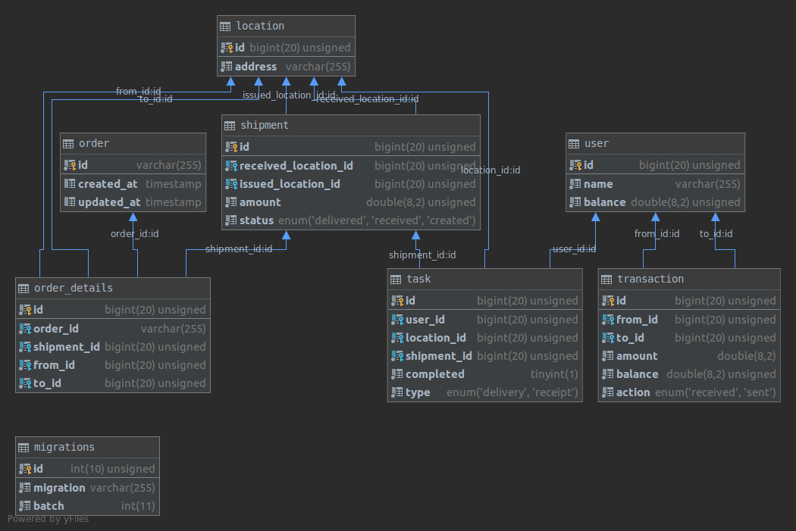

# Test Quest for GALSD

#### Specification
Specification of the task can be find [here](https://docs.google.com/document/d/1Y6PAFS2H5H-D_kSST_eoE2Jny2NXTmC1ri-F1nwBxOE/edit?usp=sharing)

#### For project Used: 
1. [Lumen 7^ version](https://lumen.laravel.com/).
2. Nginx web server by [nginx:1.10-alpine](https://hub.docker.com/_/nginx) Docker image. 
3. MySQL DB server by [mysql:5.7](https://hub.docker.com/_/mysql) Docker image.

## Deployment 
Deployment based on `docker` and `docker-composer`.
For deploy you just need to: 
1. Clone this repo into your server.
2. Make sure docker and docker-compose are installed.
3. Run init.sh from project root directory.

## Additional info
Data on database are based on laravel seeds.
By default basic seeds and migrations was provided with first deploy, using `init.sh`. 
For generate new more seeds just run next command from project root directory:
`docker-compose exec php php artisan db:seed`

## Database structure:

